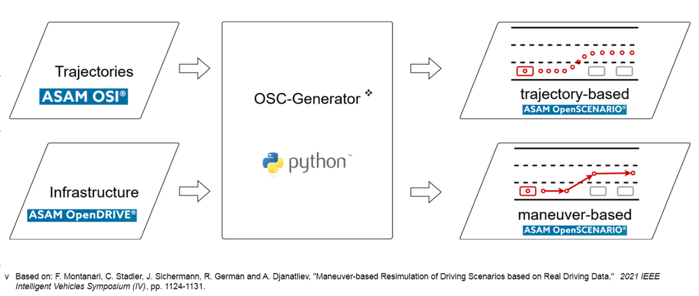

# Description
OSC-Generator is a collection of Python tools to generate [ASAM OpenSCENARIO](https://www.asam.net/standards/detail/openscenario/) files from vehicle data and an [ASAM OpenDRIVE](https://www.asam.net/standards/detail/opendrive/) file.



The generated openSCENARIO file (.xosc) can then be used in further applications, for example, visualised in a tool like [esmini](https://github.com/esmini/esmini).


## Scope of Application
Currently, OpenSCENARIO V1.2 and OpenDRIVE V1.4 are supported.
Intersections may currently cause trouble but will be supported in a future release.
All features are tested in Python 3.7 on Windows 10.

## Installation
### PyPI
- OSC-Generator can be installed using pip
  ```
  pip install osc-generator
  ```

### Testing
- Additional dependencies for testing are required.
  - Required Python packages can be installed via pip:
    ```
    pip install -r requirements_dev.txt
    ```
  - For testing, an ASAM OpenDRIVE file is needed. The file '_2017-04-04_Testfeld_A9_Nord_offset.xodr_' from [here](https://service.mdm-portal.de/mdm-portal-application/publDetail.do?publicationId=2594000) can be used by downloading a copy to the _tests/test_data_ folder. This file uses ASAM OpenDRIVE V1.4 format.
- Run pytest in the _tests_ folder or a parent folder thereof.
- When everything is set up correctly, all tests should run successfully without raising any warnings.

## Usage
- Class: OSC-Generator provides a Python class which can be used to generate a scenario in the OpenSCENARIO format from trajectories and an OpenDRIVE file. The file example.py contains runnable example code for usage of this class.
- CLI: 
  - OSC-Generator can use arguments provided via Python's commandline interface. For information on how to use this feature, see the output of the help function:
    ```
    python osc_generator.py -h 
    ```  
  - When installed via pip, OSC-Generator can directly be called in the console:
    ```
    osc_generator -h 
    ```
    
## Open Simulation Interface (OSI) Format Input 
- In order to use OSI format (.osi) input trajectory files with the OSC-Generator, the following steps are required:
  - install the Open Simulation Interface (OSI):
    - follow the installation instructions: https://github.com/OpenSimulationInterface/open-simulation-interface
  - copy the file 'OSITrace.py':
    - from "$PATH_TO_OSI_DIRECTORY\open-simulation-interface\format"
    - to "$PATH_TO_OSC-GENERATOR_DIRECTORY\OSC-Generator\osc_generator\tools\OSI"
  - run tests
  

- Usage of this feature functions as described above.   
- if OSI is not installed, the OSC-Generator can still be used with .csv input trajectory files.

## Citation
An associated [paper](https://ieeexplore.ieee.org/document/9575441) describes the original use case for which the OSC-Generator was created. 
When using this software, please cite the following: 
```
@software{OSC-Generator,
author = {{Montanari, Francesco}, {Akkaya, Yigit Ali}, {Boßmann, Nils}, {Sichermann, Jörg}, {Müller, Marcel}, {Aigner, Axel Jeronimo}, {D'Sa, Dave}},
license = {Apache-2.0},
title = {{OSC-Generator}},
url = {https://github.com/EFS-OpenSource/OSC-Generator},
version = {0.2.0}
}
```

## Acknowledgment
This work is supported by the German Federal Ministry for Digital and Transport (BMDV) within the *Automated and Connected Driving* funding program under grant No. 01MM20012F ([SAVeNoW](https://savenow.de)).

@copyright 2022 e:fs TechHub GmbH and Audi AG. All rights reserved.
https://www.efs-techhub.com/
https://www.audi.com/de/company.html

@license Apache v2.0

Licensed under the Apache License, Version 2.0 (the "License");
you may not use this file except in compliance with the License.
You may obtain a copy of the License at

    http://www.apache.org/licenses/LICENSE-2.0

Unless required by applicable law or agreed to in writing, software
distributed under the License is distributed on an "AS IS" BASIS,
WITHOUT WARRANTIES OR CONDITIONS OF ANY KIND, either express or implied.
See the License for the specific language governing permissions and
limitations under the License.
